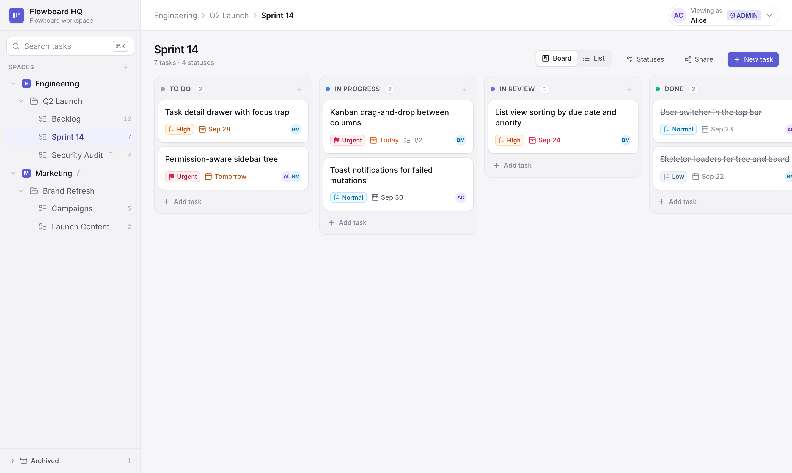
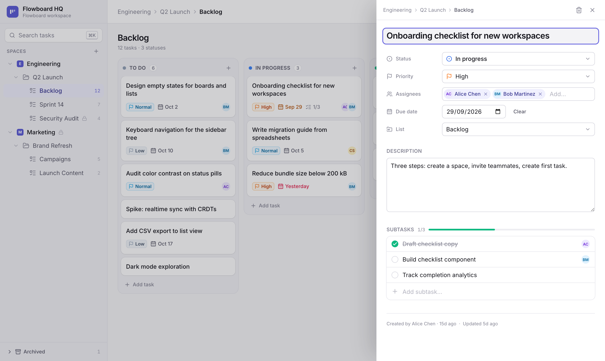
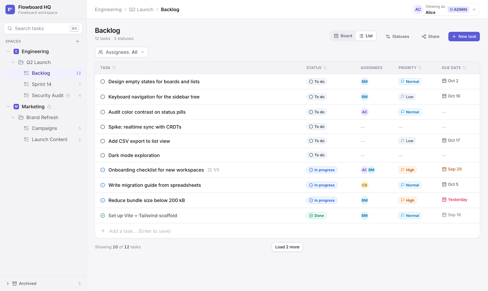
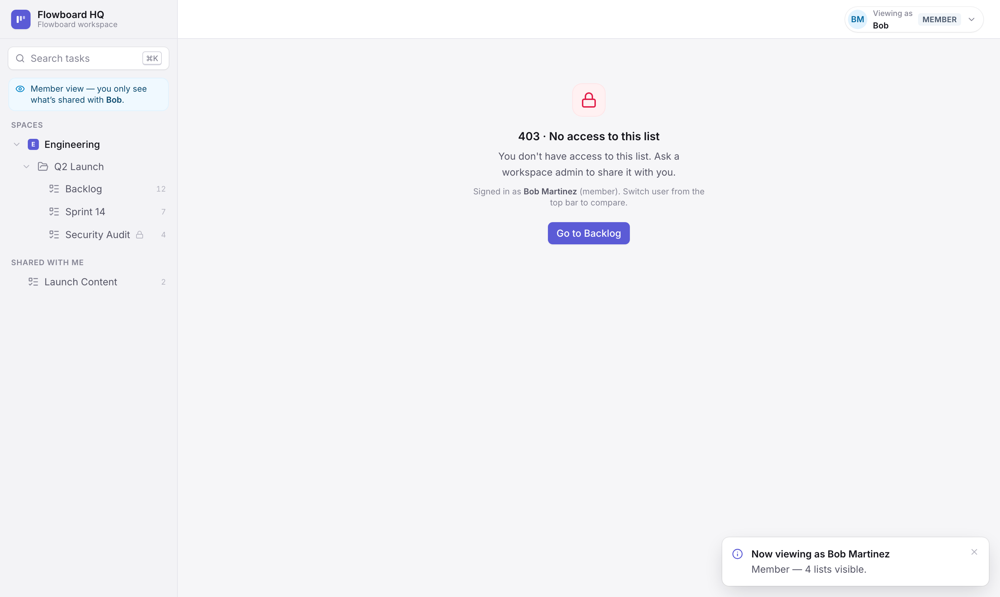
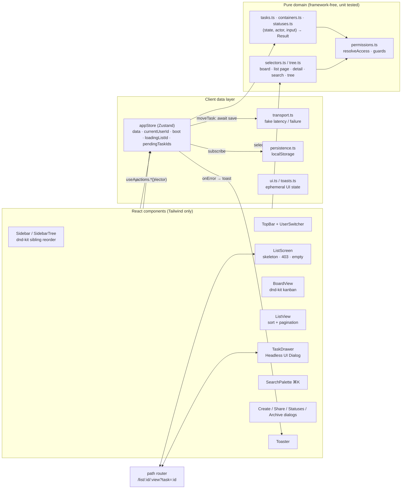

# Flowboard

A mini project-management app for one team. Organise work into **spaces → folders → lists**, manage tasks on a **kanban board** or in a **list view**, and control **who can see what**. A built-in user switcher shows the difference.

<table>
<tr>
<td width="50%"><br /><sub><b>Kanban board</b> — Sprint 14, viewed as Alice (admin)</sub></td>
<td width="50%"><br /><sub><b>Task drawer</b> — status, priority, multiple assignees, due date, subtasks</sub></td>
</tr>
<tr>
<td width="50%"><br /><sub><b>List view</b> — sortable columns, assignee filter, pagination</sub></td>
<td width="50%"><br /><sub><b>Permissions</b> — Bob (member) hits a clean 403; nothing forbidden leaks</sub></td>
</tr>
</table>

There's **no backend**: a typed Zustand store, seeded with demo data, plays the role of the API and database.

**Stack:** React 18 · TypeScript (strict) · Vite 5 · Tailwind CSS 3 · Zustand · dnd-kit · Headless UI · Vitest + Testing Library · Playwright

**Stretch goals attempted (2):** ① optimistic drag-and-drop with rollback on failure · ② client-side search on task title and description (⌘K or `/`)

🔗 **Live demo:** [flowboard-delta-ruddy.vercel.app](https://flowboard-delta-ruddy.vercel.app/)
🎥 **Demo video:** _add link_

---

## 1. Run locally

Requires **Node.js 20+** (developed on Node 22).

```bash
npm install
npm run dev          # → http://localhost:5173
```

There's nothing to configure: no `.env` file, no API keys, no database. The app opens signed in as **Alice (admin)**. To start over at any time, use **user menu → Demo controls → Reset demo data**.

More commands, the pre-commit hook and editor setup are in [11. Development](#11-development).

---

## 2. 30-second demo: Alice vs Bob

1. As **Alice (admin)**, the sidebar shows everything, including the private **Marketing** space and the private **Security Audit** list.
2. Open **Marketing › Brand Refresh › Campaigns**.
3. Switch to **Bob** with the **"Viewing as"** menu (top right). The board becomes a **403** screen straight away, and the whole Marketing space disappears from his tree. The one list shared with him inside it, **Launch Content**, appears on its own under **Shared with me**.
4. Bob can still open **Security Audit**. It's private, but explicitly shared with him ([why](#who-can-see-what)).
5. Press **⌘K** and search "launch". Bob gets no Campaigns results, because search is permission-filtered too.
6. Open the **⋯** menu on any tree item and click **Archive**. It's marked **🔒 Admins only**, and the store refuses with a **"Permission denied"** toast. Nothing changes.
7. Switch to **Carol**. She sees Marketing, but not Sprint 14 (explicit deny) or Security Audit (private, not shared with her).

**Drag-and-drop and rollback:** drag a card to another column. It moves instantly, shows a spinner while "saving", and stays there after a refresh. Then turn on **user menu → Demo controls → Simulate save failures** and drag again: the card moves, then snaps back with a "Save failed" toast.

---

## 3. Why these choices

The brief says _"We evaluate your judgment"_, so here's the reasoning behind each choice:

| Choice                                               | Why                                                                                                                                                                                                                                                                                                                                                             |
| ---------------------------------------------------- | --------------------------------------------------------------------------------------------------------------------------------------------------------------------------------------------------------------------------------------------------------------------------------------------------------------------------------------------------------------- |
| **React** (the brief allows Vue 3 or React)          | dnd-kit is the most mature drag-and-drop library for multi-column kanban with keyboard support. All business logic is framework-free (below), so moving to Vue would only mean rewriting the components.                                                                                                                                                        |
| **A pure `domain/` layer**                           | Permissions and mutations are plain TypeScript functions: `(state, user, input) → Result`. They're easy to unit-test, can't be bypassed by the UI, and could run unchanged on a server later.                                                                                                                                                                   |
| **Zustand** (the brief lists it)                     | Store + actions with almost no boilerplate. Its vanilla `createStore` lets every test create a fresh, isolated store.                                                                                                                                                                                                                                           |
| **dnd-kit**                                          | Sortable lists across containers, a drag overlay for the preview, and pointer + keyboard sensors. It needs only an inline `transform`, which the brief allows as an exception.                                                                                                                                                                                  |
| **Headless UI** (the brief's own example)            | Accessible dialogs, menus and comboboxes, with focus trapping, Escape to close and ARIA roles built in. It's unstyled, so all styling stays in Tailwind.                                                                                                                                                                                                        |
| **Path-based URLs** (`/list/<id>/<view>?task=<id>`)  | Every list and task has a shareable URL, the same shape Linear, Jira and ClickUp use, which also makes "open a list you can't access" easy to reproduce by pasting a link. A refresh or deep link asks the server for that path, so the host must serve `index.html` for unknown paths: Vite does this in dev and preview, and `vercel.json` does it on Vercel. |
| **localStorage persistence** (optional in the brief) | A drag that's lost on refresh feels broken, so changes survive a reload. The saved data is versioned, so a shape change can't break old saves.                                                                                                                                                                                                                  |
| **Vitest + Testing Library + Playwright**            | Fast unit and component tests in jsdom, plus a real browser for what jsdom can't do: real mouse drag-and-drop and reload persistence.                                                                                                                                                                                                                           |

---

## 4. Architecture

### The three layers



- **Domain (`src/domain/`)** holds the rules. Every change is a **pure function** that takes the current data and returns new data or an error. Every read is a **selector** that takes the current user and returns only what that user may see. There's no React and no store library here, which is why it's easy to test.
- **Store (`src/store/`)** is a thin Zustand wrapper. Each action calls a domain function. On success it saves the new state. On error it shows a toast automatically, so components never need their own error handling.
- **Components (`src/components/`)** read through selectors and write through `useActions()`.

### Key terms

| Term                 | Meaning                                                                                                                                |
| -------------------- | -------------------------------------------------------------------------------------------------------------------------------------- |
| **Container**        | Any node of the tree: workspace, space, folder or list. Only lists hold tasks.                                                         |
| **Status category**  | What a status _means_ to the app: `todo`, `in_progress` or `done`. The name ("In review") is just a label.                             |
| **Grant**            | A per-user rule on a container: `allow` or `deny`.                                                                                     |
| **Public / Private** | Public is visible to members by default (opt-out). Private is hidden unless explicitly allowed (opt-in).                               |
| **Shared with me**   | A sidebar section listing items shared with you inside containers you can't see. The hidden parents are never shown, not even by name. |
| **`Result`**         | What every store call returns: `{ data }` or `{ error: { code, message } }`. A code of `FORBIDDEN` is the app's 403.                   |

### Start reading here

1. **`src/domain/types.ts`**: every data type, in one short file.
2. **`src/domain/permissions.ts`**: who can see what. The rules are explained in the top comment.
3. **`src/store/appStore.ts`**: every action, most of them one-liners around a domain function, plus the optimistic `moveTask`.
4. **`src/components/ListScreen.tsx`**: how a screen handles loading, the 403 screen, empty states and board vs list.
5. **`src/components/board/BoardView.tsx`**: the kanban drag-and-drop.

### What happens when you drag a card

1. `BoardView` receives the drop from dnd-kit and calls `actions.moveTask({ taskId, toStatusId, toIndex })`.
2. The store calls the domain function `moveTask`. It checks permissions (both lists, if the task changes lists), validates the status, and re-numbers the positions in the column.
3. **Optimistic update:** the new state is saved immediately, so the card is already in place and shows a small spinner.
4. The store awaits `simulateSave()`, a fake network call in `transport.ts`.
5. **On success** the spinner clears. **On failure** only the tasks this move changed are restored (and only if nothing changed them since), and a "Save failed" toast appears.
6. `persistence.ts` writes the new state to `localStorage`.

Switching users works the same way. Only `currentUserId` changes, and every selector takes the user as an argument, so the tree, board, drawer and search update on the next render.

### Folder map

```
src/
├── domain/        types · permissions · tree · selectors · tasks · containers · statuses · ordering
├── data/seed.ts   demo data (stable ids, dates relative to "now")
├── store/         appStore · transport · persistence · toasts · ui · hooks · context
├── components/    sidebar/ · board/ · list/ · task/ · dialogs/ · search/ · layout/ · ui/
├── ui/tokens.ts   status / priority / avatar colours (one source of truth)
├── lib/           router · dates · cn (clsx + tailwind-merge)
└── test/          component tests + renderApp() helper
e2e/               Playwright browser tests
CLAUDE.md          rules and conventions for AI assistants working on this repo
.claude/skills/    step-by-step guides: adding features (+ roadmap), permissions, UI, browser checks
```

---

## 5. Data model

All data lives in one normalized object, `DataState`, with one `Record<id, entity>` per type. It's the stand-in for a database, and it's what gets saved.

```ts
Container { id, name, type: 'workspace'|'space'|'folder'|'list', parentId, position,
            visibility: 'public'|'private', archivedAt, createdAt, updatedAt }
Status    { id, listId, name, category: 'todo'|'in_progress'|'done', color, position }
Task      { id, title, description, primaryListId, statusId, priority, assigneeIds[],
            dueDate, position, parentTaskId, createdBy, createdAt, updatedAt }
Grant     { id, resourceId, userId, mode: 'allow'|'deny' }
User      { id, name, email, role: 'admin'|'member', title, avatarColor }
```

- **Hierarchy.** `CHILD_TYPE` enforces workspace → space → folder → list. Creating a child under a list returns `VALIDATION`, because lists hold tasks only. Spaces, folders and lists support create, rename, reorder and archive. The workspace can be renamed by admins from the sidebar header; there's only one, so it can't be created or archived.
- **Positions** are whole numbers spaced by 1000. A reorder or drop re-numbers only the affected column or group of siblings, which keeps the order predictable. A task's `position` is its order within its status column.
- **Statuses** belong to a list, and a task can only use its own list's statuses. When a task moves to another list, its status is matched by **same name → same category → first status**, and its subtasks move with it.
- **Assignees.** A task can have any number of assignees (`assigneeIds: ID[]`); duplicates are collapsed and unknown user ids return `VALIDATION`. The drawer's picker only suggests people who can see the list, so you can't assign someone who couldn't open the task.
- **Subtasks** are one level deep (`parentTaskId`), in the same list as their parent. They show as progress on the parent card (`2/3`) and as a checklist in the drawer.
- **Deleting.** Containers are **archived** (soft delete): the container and everything inside it are hidden from every selector, and admins can restore them from **Archived** at the bottom of the sidebar. Tasks are **hard-deleted** after an inline confirm, together with their subtasks. Containers carry structure and grants that are costly to rebuild; tasks are cheap to recreate.
- **Errors.** Every store call returns `{ data }` or `{ error: { code, message } }`. The code is one of `FORBIDDEN` (403), `NOT_FOUND`, `VALIDATION`, `CONFLICT` or `NETWORK`.
- **Persistence** (optional in the brief, enabled here). The data, the selected user and the failure toggle are saved to `localStorage` under `flowboard:v3`. The data is versioned: whenever its shape changes, the version is bumped and old saves are dropped instead of breaking the app.

---

## 6. Permissions

### The rules (`resolveAccess` in `src/domain/permissions.ts`)

1. **Admins** see and edit everything.
2. For a member looking at container _N_, an **explicit grant** on _N_ decides it: `allow` means visible, `deny` means hidden.
3. Otherwise, if _N_ is **private**, it's hidden.
4. Otherwise _N_ is **public** and **inherits** its parent's decision. The workspace root is visible to all members.

In short: **the nearest explicit rule wins**, and private is opt-in while public is opt-out. The result also records `decidedBy`, the container whose rule applied. The **Sharing** dialog uses it to explain each person's access, e.g. _"No access · 'Marketing' is private"_.

The brief defines rules 1–3. Inheritance (rule 4) and "nearest rule wins" are my additions, because the brief leaves them open.

### Who can see what

| User           | Can open                                           | Why                                                                                             |
| -------------- | -------------------------------------------------- | ----------------------------------------------------------------------------------------------- |
| Alice (admin)  | Everything                                         | Admins see everything                                                                           |
| Bob (member)   | Backlog, Sprint 14, Security Audit, Launch Content | Public lists by default, plus **allow** grants on the private Security Audit and Launch Content |
| Carol (member) | Backlog, Campaigns, Launch Content                 | **Allow** on the private Marketing space; **deny** on Sprint 14; no grant on Security Audit     |

"Private" means _only admins and people explicitly allowed_, not "hidden from all members". That's why Bob can open Security Audit and Carol can't. To see this in the app, sign in as Alice and open **⋯ → Sharing & visibility** on any list.

### Where the rules are enforced: in the store, not the UI

| Layer                                               | What it does                                                                                                                              |
| --------------------------------------------------- | ----------------------------------------------------------------------------------------------------------------------------------------- |
| `selectVisibleTree` / `selectSharedWithMe`          | Return only nodes the user can see. Anything shared inside a hidden container goes to **Shared with me**, so hidden parents never appear. |
| `selectBoard`, `selectListPage`, `selectTaskDetail` | Return `{ error: { code: 'FORBIDDEN' } }` instead of data, shown as the 403 screen or a 403 panel inside the drawer.                      |
| `searchTasks`                                       | Only searches lists the user can open.                                                                                                    |
| Every task mutation                                 | `guardViewList` / `guardTask` run first. Moving a task to another list checks **both** lists.                                             |
| Every container, status or grant mutation           | `guardManage`: admins only.                                                                                                               |
| Assignee picker                                     | `usersWithAccess(listId)`: you can't assign someone who can't see the list.                                                               |
| Breadcrumbs (top bar and task drawer)               | `visibleAncestorsOf` skips ancestors the viewer can't see, so hidden container names never appear.                                        |

**The UI never fakes a permission check:**

- When Bob clicks an admin-only action in a **⋯** menu, the click sends the **real store action**, e.g. `archiveContainer`.
- The store's `guardManage` refuses it with `FORBIDDEN`, and that appears as a **"Permission denied"** toast.
- Component tests check this for Rename, Archive, Sharing and Edit statuses, and confirm the data is unchanged.

### How I'd extend the model

- **Teams / groups.** Add `Grant.principal: { type: 'user' | 'team', id }` and resolve a user's grants across their teams. A user grant beats a team grant at the same node, and deny beats allow at the same level.
- **Permission levels, not just visibility.** Replace `allow` with levels such as `view < comment < edit < manage`, using the same nearest-rule walk. Container management would then no longer need to be admin-only.
- **Performance.** At scale, precompute an access index (`userId → Set<containerId>`) and update it when grants, visibility or structure change, instead of walking up the tree on every check. With a real server, the same pure functions would run behind the API as the source of truth.
- **Task-level sharing** for guests: a grant on a single task, checked before the list rule.

---

## 7. Styling rules and the `style=` exceptions

- **Tailwind utility classes only**, written in JSX. The only stylesheet is `src/index.css`, which contains just the three `@tailwind` lines. There are no CSS modules, no `@apply` and no CSS-in-JS.
- **Theme tokens** in `tailwind.config.ts`: `colors` (`brand`, `ink`, `canvas`, `surface`, `line`), `fontFamily` (Inter), `borderRadius` (`control`, `card`, `panel`) and `boxShadow` (`card`, `card-hover`, `drag`, `pop`, `drawer`, `focus`), plus a few animations.
- **Consistent colours.** Status, priority and avatar colours come from one map, `src/ui/tokens.ts`, used by cards, list rows, the drawer and search.
- **`cn()`** combines classes with `clsx` + `tailwind-merge`, so a later class correctly overrides an earlier one.

**DnD `style=` exceptions (the only two in the codebase):**

| File                                                      | Why                                                                                                                       |
| --------------------------------------------------------- | ------------------------------------------------------------------------------------------------------------------------- |
| `src/components/board/TaskCard.tsx` (`SortableTaskCard`)  | dnd-kit's `useSortable` produces a per-frame `transform` and `transition` that must be applied inline to the moving card. |
| `src/components/sidebar/SidebarTree.tsx` (`SortableItem`) | Same, for reordering sidebar items.                                                                                       |

Two libraries also set inline positioning themselves (I didn't write it): dnd-kit's `DragOverlay`, and Headless UI's anchored menus, via floating-ui.

---

## 8. Testing

| Kind          | File                             | Tests | What it covers                                                                                                                                                                            |
| ------------- | -------------------------------- | :---: | ----------------------------------------------------------------------------------------------------------------------------------------------------------------------------------------- |
| Permissions   | `src/domain/permissions.test.ts` |  25   | Access rules, tree filtering per user, "Shared with me", breadcrumbs, 403s from selectors, search never leaking, assignee filter                                                          |
| Store         | `src/store/appStore.test.ts`     |  20   | Every mutation, validation, 403s on writes, reordering, optimistic save + rollback                                                                                                        |
| Router        | `src/lib/router.test.ts`         |   3   | Clean paths, navigation, popstate notifications                                                                                                                                           |
| Components    | `src/test/App.test.tsx`          |  23   | The full app in jsdom: user switching, 403 screen, members trying admin actions, workspace rename, draft discard, archive dialog, drawer, list sorting + assignee filter, assignee picker |
| Browser (E2E) | `e2e/flowboard.spec.ts`          |   4   | Real mouse drag-and-drop, persistence after reload, rollback, Alice vs Bob                                                                                                                |

```bash
npm test                          # unit + component (71 tests)
npx vitest run src/domain         # one folder
npx vitest run -t "rolls back"    # tests whose name matches
npm run test:e2e                  # browser tests (run `npx playwright install chromium` once first)
```

---

## 9. Trade-offs, and what I'd do next

### Deliberate cuts

- **Container changes are admin-only.** The brief only requires that members can edit tasks, and this keeps the model easy to explain. Permission levels (section 6) would lift it.
- **Only drag-and-drop is optimistic and async.** Other changes apply to the local store immediately, which is honest for a client-only app.
- **Native `<select>` and `<input type="date">` in the drawer.** Accessible and robust, but less polished than custom dropdowns and date pickers.
- **Status editing** covers add, rename, recolour, change category and delete, but not reordering columns by drag. Deleting a status that tasks still use is refused (`CONFLICT`) rather than silently moving those tasks.
- **Search is a ⌘K palette**, not a filter on the current view. **Pagination** is "load more" over in-memory data (page size 10; Backlog has 12 tasks, so you can see it).
- **Assignee filter is list-view only.** The list view can show tasks for one or more people (or unassigned). The board doesn't filter on purpose: hiding cards mid-drag would make drop positions relative to a partial column.
- **Desktop-first:** a 960 px minimum width and no dark mode (both out of scope).
- **Bundle** is about 157 kB gzipped, mostly React DOM and Headless UI, with no code splitting.

### What I'd do next (day 4 / week 2)

1. An activity feed ("Alice moved X to Done") built on the same action pipeline, and undo for deletes.
2. Permission levels (view / edit / manage), team grants, and an access index.
3. Drag tasks onto sidebar lists to move them; drag to reorder kanban columns.
4. Bulk select, with bulk status and assignee changes in the list view.
5. Virtualized columns and rows for very large lists.
6. Storybook for cards, pills and badges, visual regression tests, and an accessibility (axe) pass in Playwright.
7. CI running the full test suite on every push (the app itself is already deployed to Vercel — see the live demo link at the top).

Detailed designs for these are in [`.claude/skills/flowboard-feature/reference/roadmap.md`](./.claude/skills/flowboard-feature/reference/roadmap.md).

---

## 10. AI usage log

**Tool:** Claude Code (Claude Opus), used as a pair programmer throughout: scaffolding, the domain and store layers, components, tests and this README. I reviewed every change, and verified the UI by driving the running app with Playwright screenshots rather than trusting generated code.

**Where it helped most:** the boilerplate-heavy parts (Tailwind tokens, dnd-kit multi-container wiring, Headless UI dialogs), generating seed fixtures with a deliberate permission scenario, and writing the first draft of the test matrix.

**Where I corrected it:** see [AI_USAGE.md](./AI_USAGE.md) for specifics. Examples include a class-merge bug that broke a dialog's layout, a JS auto-grow that broke the no-inline-style rule, a non-existent Tailwind class, a permission "reason" that threw away information, and a flaky E2E drag helper.

---

## 11. Development

### Commands

| Command                             | What it does                                                         |
| ----------------------------------- | -------------------------------------------------------------------- |
| `npm start` / `npm run dev`         | Dev server with hot reload on http://localhost:5173                  |
| `npm test` / `npm run test:watch`   | Unit and component tests, once or on every save                      |
| `npm run test:e2e`                  | Playwright browser tests                                             |
| `npm run typecheck`                 | TypeScript check (strict)                                            |
| `npm run lint`                      | ESLint                                                               |
| `npm run format` / `format:check`   | Prettier: fix or check formatting (Tailwind classes are auto-sorted) |
| `npm run check:dead`                | knip: fails on unused files, exports or dependencies                 |
| `npm run build` / `npm run preview` | Production build into `dist/` / serve that build locally             |

### Before you commit

- **Pre-commit hook** (husky + lint-staged): `git commit` formats the staged files with Prettier, then runs ESLint on them. **The commit is rejected on any lint error or warning.** It's installed automatically by `npm install`.
- **Before a PR**, run `npm run typecheck && npm run lint && npm run format:check && npm test && npm run check:dead`. If the UI changed, also run `npm run test:e2e`.
- **Editor:** VS Code prompts you to install the recommended extensions (ESLint, Prettier, Tailwind CSS IntelliSense, Vitest, Playwright). Files are then formatted and ESLint-fixed on save.
- **AI assistants:** [`CLAUDE.md`](./CLAUDE.md) holds the project's rules for AI tools, and `.claude/skills/` has step-by-step guides.

### Troubleshooting

| Problem                                   | Fix                                                                                       |
| ----------------------------------------- | ----------------------------------------------------------------------------------------- |
| Blank white page                          | Check the browser console, then run `npm run typecheck`. Usually a broken import.         |
| Old or odd data after pulling changes     | **User menu → Reset demo data**, or run `localStorage.clear()` in the console and reload. |
| Port 5173 already in use                  | A dev server is already running. Use that tab, or Vite will pick the next free port.      |
| E2E fails with "Executable doesn't exist" | Run `npx playwright install chromium` once.                                               |
| Commit rejected by the hook               | Fix the lines ESLint reports, `git add` them, and commit again.                           |
| Saving in VS Code doesn't format          | Install the Prettier extension and set it as the default formatter.                       |
