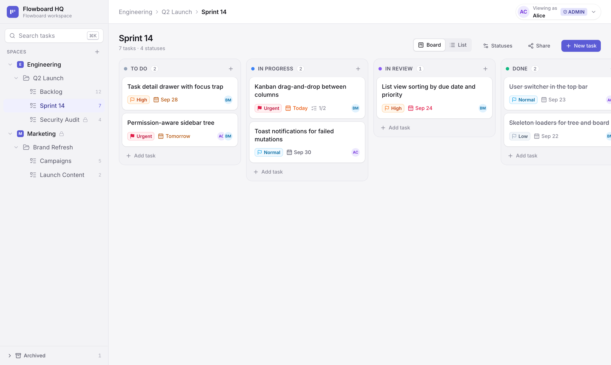
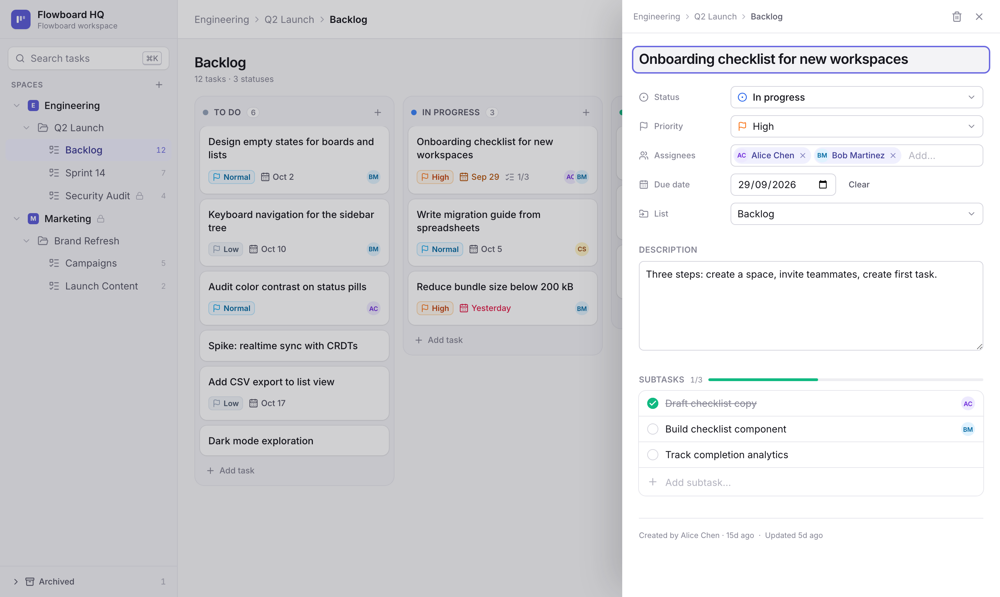
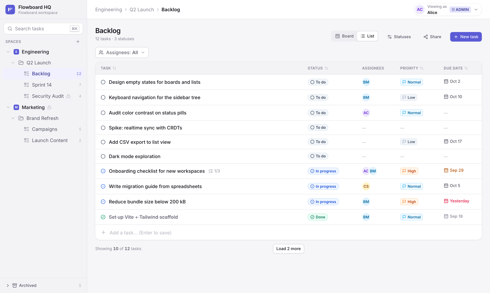
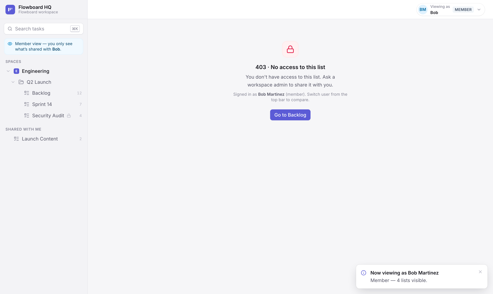
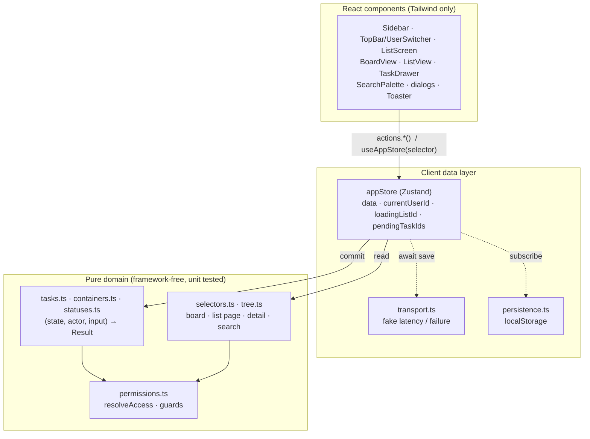

# Flowboard

A mini project-management app for one team. Organise work into **spaces → folders → lists**, manage tasks on a **kanban board** or in a **list view**, and control **who can see what**. A built-in user switcher shows the difference.

<table>
<tr>
<td width="50%"><br /><sub><b>Kanban board</b> — Sprint 14, viewed as Alice (admin)</sub></td>
<td width="50%"><br /><sub><b>Task drawer</b> — status, priority, multiple assignees, due date, subtasks</sub></td>
</tr>
<tr>
<td width="50%"><br /><sub><b>List view</b> — sortable columns, assignee filter, pagination</sub></td>
<td width="50%"><br /><sub><b>Permissions</b> — Bob (member) hits a clean 403; nothing forbidden leaks</sub></td>
</tr>
</table>

🔗 **Deployed link:** [flowboard-delta-ruddy.vercel.app](https://flowboard-delta-ruddy.vercel.app/)

🎥 **Demo video:** [Watch on Loom (about 4 min)](https://www.loom.com/share/aad3f361ffb94ce2884d534543534981)

**Stack:** React 18 · TypeScript (strict) · Vite 5 · Tailwind CSS 3 · Zustand · dnd-kit · Headless UI · Vitest + Testing Library · Playwright. There's **no backend**: a typed Zustand store, seeded with demo data, plays the role of the API and database.

**Stretch goals attempted (2):** ① optimistic drag-and-drop with rollback on failure · ② client-side search on task title and description (⌘K or `/`)

---

## 1. Run locally

Requires **Node.js 20+** (developed on Node 22).

```bash
npm install
npm run dev          # → http://localhost:5173
```

Nothing to configure: no `.env`, no API keys, no database. The app opens as **Alice (admin)**. To start over, use **user menu → Demo controls → Reset demo data**. More commands, the pre-commit hook and editor setup are in [10. Development](#10-development).

---

## 2. 30-second demo: Alice vs Bob

1. As **Alice (admin)**, the sidebar shows everything, including the private **Marketing** space and the private **Security Audit** list.
2. Open **Marketing › Brand Refresh › Campaigns**.
3. Switch to **Bob** with the **"Viewing as"** menu (top right). The board becomes a **403** screen straight away and the whole Marketing space disappears from his tree. The one list shared with him inside it, **Launch Content**, appears on its own under **Shared with me**.
4. Bob can still open **Security Audit**: it's private, but explicitly shared with him ([why](#who-can-see-what)).
5. Press **⌘K** and search "launch". Bob gets no Campaigns results, because search is permission-filtered too.
6. Open **⋯** on any tree item and click **Archive**. It's marked **🔒 Admins only**, and the store refuses with a **"Permission denied"** toast. Nothing changes.
7. Switch to **Carol**. She sees Marketing, but not Sprint 14 (explicit deny) or Security Audit (private, not shared with her).

**Drag-and-drop and rollback:** drag a card to another column. It moves instantly, shows a spinner while "saving", and stays there after a refresh. Then turn on **user menu → Demo controls → Simulate save failures** and drag again: the card moves, then snaps back with a "Save failed" toast.

---

## 3. Architecture


```mermaid
flowchart TD
  subgraph UI["React components (Tailwind only)"]
    Views["Sidebar · TopBar/UserSwitcher · ListScreen<br/>BoardView · ListView · TaskDrawer<br/>SearchPalette · dialogs · Toaster"]
  end

  subgraph Store["Client data layer"]
    AS["appStore (Zustand)<br/>data · currentUserId · loadingListId · pendingTaskIds"]
    TR["transport.ts<br/>fake latency / failure"]
    PE["persistence.ts<br/>localStorage"]
  end

  subgraph Domain["Pure domain (framework-free, unit tested)"]
    MUT["tasks.ts · containers.ts · statuses.ts<br/>(state, actor, input) → Result"]
    SEL["selectors.ts · tree.ts<br/>board · list page · detail · search"]
    PM["permissions.ts<br/>resolveAccess · guards"]
  end

  Views -- "actions.*()  /  useAppStore(selector)" --> AS
  AS -- commit --> MUT
  AS -- read --> SEL
  MUT --> PM
  SEL --> PM
  AS -. "await save" .-> TR
  AS -. subscribe .-> PE
```

- **Domain (`src/domain/`)** holds the rules. Every change is a **pure function** that takes the current data and returns new data or an error. Every read is a **selector** that takes the current user and returns only what that user may see. No React and no store library, so it's easy to test.
- **Store (`src/store/`)** is a thin Zustand wrapper. Each action calls a domain function; on success it saves the new state, on error it shows a toast automatically, so components never need their own error handling.
- **Components (`src/components/`)** read through selectors and write through `useActions()`. Screen-level components (`Sidebar`, `ListScreen`, `TaskDrawer`) connect to the store and pass data and callbacks down. The shared `ui/` components and the sidebar's tree, rows, header and archive list take props only; an ESLint rule stops them importing the store.

**What happens when you drag a card:**

1. `BoardView` gets the drop from dnd-kit and calls `actions.moveTask({ taskId, toStatusId, toIndex })`.
2. The domain `moveTask` checks permissions (both lists, if the task changes lists), validates the status and re-numbers the column's positions.
3. **Optimistic update:** the store saves the new state immediately, so the card is already in place with a small spinner.
4. The store awaits `simulateSave()`, a fake network call in `transport.ts`.
5. **On success** the spinner clears. **On failure** only the tasks this move changed are restored (and only if nothing changed them since), and a "Save failed" toast appears.
6. `persistence.ts` writes the new state to `localStorage`.

Switching users works the same way: only `currentUserId` changes, and every selector takes the user as an argument, so the tree, board, drawer and search update on the next render.

### Subscribing to only what a component reads

Components don't subscribe to the whole data set. `useDataWith('tasks', 'statuses')` returns just those parts (plus the users, containers and grants every permission check needs), and the domain read functions are typed to accept exactly that (`DataWith<...>`). A component re-renders only when a part it named is replaced, so a new comment doesn't rebuild the sidebar tree or the board. The task drawer and the search palette read data only while open. `src/test/subscriptions.test.tsx` fails if this regresses.

### Why these choices

The brief says _"We evaluate your judgment"_, so here's the reasoning:

| Choice                                              | Why                                                                                                                                                                                                                                                           |
| --------------------------------------------------- | ------------------------------------------------------------------------------------------------------------------------------------------------------------------------------------------------------------------------------------------------------------- |
| **React** (the brief allows Vue 3 or React)         | dnd-kit is the most mature drag-and-drop library for a multi-column kanban with keyboard support. All business logic is framework-free, so a Vue port would only rewrite the components.                                                                      |
| **A pure `domain/` layer**                          | Permissions and mutations are plain functions, `(state, user, input) → Result`: easy to unit-test, impossible for the UI to bypass, and able to run unchanged on a server later.                                                                              |
| **Zustand** (the brief lists it)                    | Store + actions with almost no boilerplate. Its vanilla `createStore` lets every test create a fresh, isolated store.                                                                                                                                         |
| **dnd-kit**                                         | Sortable lists across containers, a drag overlay for the preview, pointer + keyboard sensors. It needs only an inline `transform`, which the brief allows.                                                                                                    |
| **Headless UI** (the brief's own example)           | Accessible dialogs, menus and comboboxes with focus trapping, Escape to close and ARIA roles built in. Unstyled, so all styling stays in Tailwind.                                                                                                            |
| **Path-based URLs** (`/list/<id>/<view>?task=<id>`) | Every list and task has a shareable URL (the shape Linear, Jira and ClickUp use), so "open a list you can't access" is reproducible by pasting a link. The host must serve `index.html` for unknown paths: Vite does in dev/preview, `vercel.json` on Vercel. |
| **localStorage persistence** (optional)             | A drag that's lost on refresh feels broken, so changes survive a reload. Saves are versioned (see [Data model](#4-data-model)).                                                                                                                               |
| **Vitest + Testing Library + Playwright**           | Fast unit and component tests in jsdom, plus a real browser for what jsdom can't do: real mouse drag-and-drop and reload persistence.                                                                                                                         |

<details>
<summary><b>Start reading here, and the folder map</b></summary>

1. **`src/domain/types.ts`**: every data type, in one short file.
2. **`src/domain/permissions.ts`**: who can see what; the rules are explained in the top comment.
3. **`src/store/appStore.ts`**: every action (mostly one-liners around a domain function), plus the optimistic `moveTask`.
4. **`src/components/ListScreen.tsx`**: loading, the 403 screen, empty states, and board vs list.
5. **`src/components/board/BoardView.tsx`**: the kanban drag-and-drop.

```
src/
├── domain/        types · permissions · tree · selectors · tasks · containers · statuses · ordering
├── data/seed.ts   demo data (stable ids, dates relative to "now")
├── store/         appStore · transport · persistence · toasts · ui · hooks · context
├── components/    sidebar/ · board/ · list/ · task/ · dialogs/ · search/ · layout/ · ui/
├── ui/tokens.ts   status / priority / avatar colours (one source of truth)
├── lib/           router · dates · cn (clsx + tailwind-merge)
└── test/          component tests + renderApp() helper
e2e/               Playwright browser tests
CLAUDE.md          rules and conventions for AI assistants working on this repo
.claude/skills/    step-by-step guides: adding features (+ roadmap), permissions, UI, browser checks
```

</details>

---

## 4. Data model

All data lives in one normalized object, `DataState`, with one `Record<id, entity>` per type. It stands in for the database, and it's what gets saved.

```ts
Container { id, name, type: 'workspace'|'space'|'folder'|'list', parentId, position,
            visibility: 'public'|'private', archivedAt, createdAt, updatedAt }
Status    { id, listId, name, category: 'todo'|'in_progress'|'done', color, position }
Task      { id, title, description, primaryListId, statusId, priority, assigneeIds[],
            dueDate, position, parentTaskId, createdBy, createdAt, updatedAt }
Grant     { id, resourceId, userId, mode: 'allow'|'deny' }
User      { id, name, email, role: 'admin'|'member', title, avatarColor }
Comment   { id, taskId, authorId, body, createdAt, mentions[], readBy[] }
ActivityEvent { id, at, actorId, taskId, kind: 'task.created'|'task.updated', changes[] }
Attachment { id, taskId, name, mime, size, createdBy, createdAt }   // metadata only; the file is in IndexedDB
Sprint    { id, listId, name, startedAt, endsOn, startedBy, taskIds[], endedAt, endedBy, report }
```

`ActivityEvent.changes` stores ids (for example a status id); names are resolved when the task drawer reads them, so a rename shows up in old history. The store appends an event after each successful create, update or move, using the builders in `src/domain/activity.ts`, so the task mutations themselves don't know about history. A move that fails to save is rolled back together with its event, and deleting a task deletes its comments and history. Only the newest 500 events are kept.

**Mentions** are plain text in a comment: `@Alice Chen`, or `@Alice` when only one person with access has that first name. One scan (`mentionSpans` in `src/domain/mentions.ts`) decides who is tagged when the comment is saved and which words are highlighted when it's shown, so the two can't disagree. Only people who can see the task are tagged, never the author. `readBy` records which tagged people have read it.

**Sprints** belong to a list, and only one can run per list. Starting one records which top-level tasks are still open; tasks created while it runs join it automatically. Ending it (admin only) freezes a `report`: how many tasks were **done** and how many **spilled over** (still open, so they stay in the list and join the next sprint), plus a tally per person. The report is a snapshot, so editing or deleting tasks later doesn't change a sprint that already ended.

**Attachments** keep only their metadata in `DataState` (so the saved data stays small). The file's bytes go to the browser's IndexedDB, keyed by the attachment id, behind a small `BlobStore` interface (`src/store/blobs.ts`; tests use an in-memory one). Removing an attachment, deleting its task or resetting the demo deletes the stored files too, and orphans are pruned at startup.

| Term                 | Meaning                                                                                                                                                                          |
| -------------------- | -------------------------------------------------------------------------------------------------------------------------------------------------------------------------------- |
| **Container**        | Any node of the tree: workspace, space, folder or list. Only lists hold tasks.                                                                                                   |
| **Status category**  | What a status _means_ to the app: `todo`, `in_progress` or `done`. The name ("In review") is just a label.                                                                       |
| **Grant**            | A per-user rule on a container: `allow` or `deny`.                                                                                                                               |
| **Public / Private** | Public is visible to members by default (opt-out). Private is hidden unless explicitly allowed (opt-in).                                                                         |
| **Shared with me**   | A sidebar section listing items shared with you inside containers you can't see. The hidden parents are never shown, not even by name.                                           |
| **`Result`**         | What every store call returns: `{ data }` or `{ error: { code, message } }`, with `code` one of `FORBIDDEN` (the app's 403), `NOT_FOUND`, `VALIDATION`, `CONFLICT` or `NETWORK`. |

- **Hierarchy.** `CHILD_TYPE` enforces workspace → space → folder → list; creating a child under a list returns `VALIDATION`. Spaces, folders and lists support create, rename, reorder and archive. Admins can rename the workspace from the sidebar header; there's only one, so it can't be created or archived.
- **Positions** are whole numbers spaced by 1000. A reorder or drop re-numbers only the affected column or sibling group, which keeps order predictable. A task's `position` is its order within its status column.
- **Statuses** belong to a list, and a task can only use its own list's statuses. When a task moves to another list, its status is matched by **same name → same category → first status**, and its subtasks move with it.
- **Assignees.** Any number per task (`assigneeIds: ID[]`); duplicates are collapsed and unknown ids return `VALIDATION`. The assignee button sits left of the task title and opens a searchable, multi-select list; it only offers people who can see the list (anyone already assigned who has lost access stays listed so they can be removed).
- **Subtasks** are one level deep (`parentTaskId`), in the parent's list. They show as progress on the parent card (`2/3`) and as a checklist in the drawer.
- **Deleting.** Containers are **archived** (soft delete): the container and everything inside it disappear from every selector, and admins can restore them from **Archived** at the bottom of the sidebar. Tasks are **hard-deleted** after an inline confirm, with their subtasks. Containers carry structure and grants that are costly to rebuild; tasks are cheap to recreate.
- **Persistence** (optional in the brief, enabled here). The data, the selected user and the failure toggle are saved to `localStorage` under `flowboard:v3`. Whenever the data's shape changes the version is bumped, and old saves are dropped instead of breaking the app.

---

## 5. Permissions

### The rules (`resolveAccess` in `src/domain/permissions.ts`)

1. **Admins** see and edit everything.
2. For a member looking at container _N_, an **explicit grant** on _N_ decides: `allow` → visible, `deny` → hidden.
3. Otherwise, if _N_ is **private**, it's hidden.
4. Otherwise _N_ is **public** and **inherits** its parent's decision. The workspace root is visible to all members.

So **the nearest explicit rule wins**; private is opt-in, public is opt-out. The brief defines rules 1–3; inheritance and "nearest rule wins" are my additions, because the brief leaves them open. The result also records `decidedBy`, the container whose rule applied, which the **Sharing** dialog uses to explain access, e.g. _"No access · 'Marketing' is private"_.

### Who can see what

| User           | Can open                                           | Why                                                                                             |
| -------------- | -------------------------------------------------- | ----------------------------------------------------------------------------------------------- |
| Alice (admin)  | Everything                                         | Admins see everything                                                                           |
| Bob (member)   | Backlog, Sprint 14, Security Audit, Launch Content | Public lists by default, plus **allow** grants on the private Security Audit and Launch Content |
| Carol (member) | Backlog, Campaigns, Launch Content                 | **Allow** on the private Marketing space; **deny** on Sprint 14; no grant on Security Audit     |

"Private" means _only admins and people explicitly allowed_, not "hidden from all members". That's why Bob can open Security Audit and Carol can't. To see it in the app, sign in as Alice and open **⋯ → Sharing & visibility** on any list.

### Enforced in the store, not the UI

| Layer                                               | What it does                                                                                                                                                                                                                                                                                           |
| --------------------------------------------------- | ------------------------------------------------------------------------------------------------------------------------------------------------------------------------------------------------------------------------------------------------------------------------------------------------------ |
| `selectVisibleTree` / `selectSharedWithMe`          | Return only nodes the user can see. Anything shared inside a hidden container goes to **Shared with me**, so hidden parents never appear.                                                                                                                                                              |
| `selectBoard`, `selectListPage`, `selectTaskDetail` | Return `{ error: { code: 'FORBIDDEN' } }` instead of data, shown as the 403 screen or a 403 panel inside the drawer.                                                                                                                                                                                   |
| `searchTasks`                                       | Only searches lists the user can open.                                                                                                                                                                                                                                                                 |
| Every task mutation                                 | `guardViewList` / `guardTask` run first. Moving a task to another list checks **both** lists.                                                                                                                                                                                                          |
| Every container, status or grant mutation           | `guardManage`: admins only.                                                                                                                                                                                                                                                                            |
| Assignee picker                                     | `usersWithAccess(listId)`: you can't assign someone who can't see the list.                                                                                                                                                                                                                            |
| Mentions                                            | `addComment` tags only `usersWithAccess` for the task's list, so tagging never shows a task to someone who couldn't open it. `selectMentions` lists a member's mentions only on tasks they can currently see (checked by `guardViewList`), so losing access to a list hides its mentions and its name. |
| Sprints                                             | `startSprint` / `endSprint` run `guardManage` (admins only) and then the list guard. `selectSprints` and `selectSprintReport` run the list guard, so a member sees a list's sprints and reports only if they can open the list.                                                                        |
| Comments and task history                           | `addComment` runs `guardTask`. `selectTaskDetail` builds the timeline only after the same guard, and withholds the name of any list in a "moved" entry that the viewer can't see.                                                                                                                      |
| Breadcrumbs (top bar and task drawer)               | `visibleAncestorsOf` skips ancestors the viewer can't see, so hidden container names never appear.                                                                                                                                                                                                     |

**The UI never fakes a permission check.** When Bob clicks an admin-only action in a **⋯** menu, it sends the **real store action** (e.g. `archiveContainer`); `guardManage` refuses it with `FORBIDDEN`, shown as a **"Permission denied"** toast. Component tests cover Rename, Archive, Sharing and Edit statuses, and confirm the data is unchanged.

### How I'd extend the model

- **Teams / groups.** Add `Grant.principal: { type: 'user' | 'team', id }` and resolve a user's grants across their teams. A user grant beats a team grant at the same node, and deny beats allow at the same level.
- **Permission levels, not just visibility.** Replace `allow` with levels such as `view < comment < edit < manage`, using the same nearest-rule walk; container management would then no longer need to be admin-only.
- **Performance.** At scale, precompute an access index (`userId → Set<containerId>`), updated when grants, visibility or structure change, instead of walking up the tree on every check. With a real server, the same pure functions would run behind the API as the source of truth.
- **Task-level sharing** for guests: a grant on a single task, checked before the list rule.

---

## 6. Styling rules and the `style=` exceptions

- **Tailwind utility classes only**, in JSX. The only stylesheet, `src/index.css`, holds just the three `@tailwind` lines: no CSS modules, no `@apply`, no CSS-in-JS.
- **Theme tokens** in `tailwind.config.ts`: `colors` (`brand`, `ink`, `canvas`, `surface`, `line`), `fontFamily` (Inter), `borderRadius` (`control`, `card`, `panel`) and `boxShadow` (`card`, `card-hover`, `drag`, `pop`, `drawer`, `focus`), plus a few animations.
- **Consistent colours.** Status, priority and avatar colours come from one map, `src/ui/tokens.ts`, used by cards, list rows, the drawer and search.
- **`cn()`** combines classes with `clsx` + `tailwind-merge`, so a later class correctly overrides an earlier one.

**DnD `style=` exceptions (the only two in the codebase):**

| File                                                      | Why                                                                                                                       |
| --------------------------------------------------------- | ------------------------------------------------------------------------------------------------------------------------- |
| `src/components/board/TaskCard.tsx` (`SortableTaskCard`)  | dnd-kit's `useSortable` produces a per-frame `transform` and `transition` that must be applied inline to the moving card. |
| `src/components/sidebar/SidebarTree.tsx` (`SortableItem`) | Same, for reordering sidebar items.                                                                                       |

Two libraries also set inline positioning themselves (not code I wrote): dnd-kit's `DragOverlay`, and Headless UI's anchored menus via floating-ui.

---

## 7. Testing

| Kind             | File                              | Tests | What it covers                                                                                                                                                                                                                                                                                                  |
| ---------------- | --------------------------------- | :---: | --------------------------------------------------------------------------------------------------------------------------------------------------------------------------------------------------------------------------------------------------------------------------------------------------------------- |
| Mentions         | `src/domain/mentions.test.ts`     |  14   | `@Name` matching (full or unambiguous first name, not emails), only people with access are tagged, read state, per-member inbox, nothing shown for tasks you can't see                                                                                                                                          |
| Sprints          | `src/domain/sprints.test.ts`      |  13   | Start and end rules (admin only, one per list), which tasks count, done vs spilled over, per-person tally, frozen reports, 403 on hidden lists                                                                                                                                                                  |
| Mentions UI      | `src/test/mentions.test.tsx`      |  10   | `@` suggestions, highlighted mentions, each member's unread count, opening a mention, mark all read, live updates                                                                                                                                                                                               |
| Editing in place | `src/test/inlineEdit.test.tsx`    |  14   | Rename, status, priority, due date and assignees from board cards and list rows without opening the drawer; Enter/Space inside a control doesn't open it; board filters                                                                                                                                         |
| Subscriptions    | `src/test/subscriptions.test.tsx` |   3   | A comment doesn't rebuild the sidebar tree or the board; a task edit rebuilds the board but not the tree                                                                                                                                                                                                        |
| Attachments      | `src/domain/attachments.test.ts`  |   8   | Allowed types (no SVG), size and count limits, 403 for members without access, drafts with files are kept                                                                                                                                                                                                       |
| Activity         | `src/domain/activity.test.ts`     |   9   | Comment rules and 403, which field changes are recorded, timeline order, hidden list names in history                                                                                                                                                                                                           |
| Permissions      | `src/domain/permissions.test.ts`  |  29   | Access rules, tree filtering per user, "Shared with me", breadcrumbs, 403s from selectors, search never leaking, assignee filter                                                                                                                                                                                |
| Store            | `src/store/appStore.test.ts`      |  35   | Every mutation, validation, 403s on writes, reordering, optimistic save + rollback, history recording (none for no-ops or rolled-back moves), cascade delete                                                                                                                                                    |
| Router           | `src/lib/router.test.ts`          |   3   | Clean paths, navigation, popstate notifications                                                                                                                                                                                                                                                                 |
| Components       | `src/test/App.test.tsx`           |  35   | The full app in jsdom: user switching, 403 screen, members trying admin actions, workspace rename, draft discard, archive dialog, drawer, list sorting + assignee filter, assignee picker, task comments and history                                                                                            |
| Browser (E2E)    | `e2e/flowboard.spec.ts`           |   9   | Real mouse drag-and-drop, persistence after reload, rollback, Alice vs Bob, Escape closing the assignee dropdown before the drawer, an uploaded image surviving a reload, a finished sprint printing as a clean one-page report, dragging on a filtered board, tagging someone and finding it in their Mentions |

```bash
npm test                          # unit + component (173 tests)
npx vitest run src/domain         # one folder
npx vitest run -t "rolls back"    # tests whose name matches
npm run test:e2e                  # browser tests (run `npx playwright install chromium` once first)
```

---

## 8. Trade-offs, and what I'd do next

### Deliberate cuts

- **Container changes are admin-only.** The brief only requires that members can edit tasks, and this keeps the model easy to explain. Permission levels (section 5) would lift it.
- **Only drag-and-drop is optimistic and async.** Other changes apply to the local store immediately, which is honest for a client-only app.
- **Native `<select>` and `<input type="date">` in the drawer:** accessible and robust, but less polished than custom dropdowns and date pickers.
- **Status editing** covers add, rename, recolour, change category and delete, but not reordering columns by drag. Deleting a status that tasks still use is refused (`CONFLICT`) rather than silently moving those tasks.
- **Search is a ⌘K palette**, not a filter on the current view. **Pagination** is "load more" over in-memory data (page size 10; Backlog has 12 tasks, so you can see it).
- **Filters work on the board and the list** (name, plus one or more assignees or "Unassigned"), and carry over when you switch views. On the board, non-matching cards are only hidden: each column keeps its full order underneath, so a drop between visible cards still lands in the right place even with hidden cards between them.
- **Editing in place:** a board card or list row lets you rename the task, change its status, priority and due date, and pick assignees without opening the drawer. Controls are plain menus and popovers, not drag handles; a click that isn't on a control still opens the drawer. Changing a status on the board moves the card to the bottom of that column, like the drawer does.
- **Mentions are an inbox, not push notifications.** A member sees their mentions in the top bar's `@` menu, with an unread count; nothing is delivered elsewhere, and there's no email. Tagging works in comments only (not in descriptions), and a tag is plain text, so editing the name afterwards isn't tracked (comments can't be edited anyway).
- **Comments and task history** (in the task drawer) are an extra beyond the two stretch goals above. Comments are plain text, with no editing, deleting, replies or @mentions. History covers task create and edit events only, not container or status changes, and isn't a security audit log because it lives in the browser.
- **Sprints and the printable report** go beyond the brief. They are per list, with one running sprint at a time. Not built: a backlog across lists, sprint goals, velocity or burndown charts, and moving spilled tasks into a chosen sprint (they simply stay in the list). A task moved into the list mid-sprint isn't counted; one created in it is. The print button uses the browser's print dialog, with print-only styles that hide the app around the report.
- **List search** matches the task name only. The ⌘K palette also searches descriptions, and covers every list you can see.
- **Image and video attachments** (under the description in the task drawer) go beyond the brief, which lists "no file uploads" as out of scope. They are stored in IndexedDB, so they survive a reload but live only in one browser. Limits: PNG, JPEG, GIF, WebP, AVIF, MP4, WebM, OGG or QuickTime; 10 MB per image, 50 MB per video, 20 per task. SVG is refused on purpose because an SVG can carry script. With a real backend these would go to object storage behind signed URLs.
- **Desktop-first:** a 960 px minimum width and no dark mode (both out of scope).
- **Bundle** is about 157 kB gzipped, mostly React DOM and Headless UI, with no code splitting.

### What I'd do next (day 4 / week 2)

1. A workspace-wide activity feed (each task already has its own history), history for container changes, and undo for deletes.
2. Permission levels (view / edit / manage), team grants, and an access index.
3. Drag tasks onto sidebar lists to move them; drag to reorder kanban columns.
4. Bulk select, with bulk status and assignee changes in the list view.
5. Virtualized columns and rows for very large lists.
6. Storybook for cards, pills and badges, visual regression tests, and an accessibility (axe) pass in Playwright.
7. CI running the full test suite on every push (the app itself is already deployed to Vercel; see the deployed link at the top).

Detailed designs are in [`.claude/skills/flowboard-feature/reference/roadmap.md`](./.claude/skills/flowboard-feature/reference/roadmap.md).

---

## 9. AI usage log

**Tool:** Claude Code (Claude Opus), used as a pair programmer throughout: scaffolding, the domain and store layers, components, tests and this README. I reviewed every change, and verified the UI by driving the running app with Playwright screenshots rather than trusting generated code.

**Where it helped most:** the boilerplate-heavy parts (Tailwind tokens, dnd-kit multi-container wiring, Headless UI dialogs), seed fixtures with a deliberate permission scenario, and the first draft of the test matrix.

**Where I corrected it:** see [AI_USAGE.md](./AI_USAGE.md). Examples include private space names leaking into Bob's sidebar, a 403 on mutations that members could never actually see, hash-based URLs built on a wrong assumption, and README wording that made correct behaviour look like a bug.

---

## 10. Development

<details>
<summary><b>Commands, pre-commit hook, editor setup and troubleshooting</b></summary>

| Command                             | What it does                                                         |
| ----------------------------------- | -------------------------------------------------------------------- |
| `npm start` / `npm run dev`         | Dev server with hot reload on http://localhost:5173                  |
| `npm test` / `npm run test:watch`   | Unit and component tests, once or on every save                      |
| `npm run test:e2e`                  | Playwright browser tests                                             |
| `npm run typecheck`                 | TypeScript check (strict)                                            |
| `npm run lint`                      | ESLint                                                               |
| `npm run format` / `format:check`   | Prettier: fix or check formatting (Tailwind classes are auto-sorted) |
| `npm run check:dead`                | knip: fails on unused files, exports or dependencies                 |
| `npm run build` / `npm run preview` | Production build into `dist/` / serve that build locally             |

- **Pre-commit hook** (husky + lint-staged): `git commit` formats the staged files with Prettier, then runs ESLint on them. **The commit is rejected on any lint error or warning.** It's installed automatically by `npm install`.
- **Before a PR**, run `npm run typecheck && npm run lint && npm run format:check && npm test && npm run check:dead`. If the UI changed, also run `npm run test:e2e`.
- **Editor:** VS Code prompts you to install the recommended extensions (ESLint, Prettier, Tailwind CSS IntelliSense, Vitest, Playwright). Files are then formatted and ESLint-fixed on save.
- **AI assistants:** [`CLAUDE.md`](./CLAUDE.md) holds the project's rules for AI tools, and `.claude/skills/` has step-by-step guides.

| Problem                                   | Fix                                                                                       |
| ----------------------------------------- | ----------------------------------------------------------------------------------------- |
| Blank white page                          | Check the browser console, then run `npm run typecheck`. Usually a broken import.         |
| Old or odd data after pulling changes     | **User menu → Reset demo data**, or run `localStorage.clear()` in the console and reload. |
| Port 5173 already in use                  | A dev server is already running. Use that tab, or Vite will pick the next free port.      |
| E2E fails with "Executable doesn't exist" | Run `npx playwright install chromium` once.                                               |
| Commit rejected by the hook               | Fix the lines ESLint reports, `git add` them, and commit again.                           |
| Saving in VS Code doesn't format          | Install the Prettier extension and set it as the default formatter.                       |

</details>
